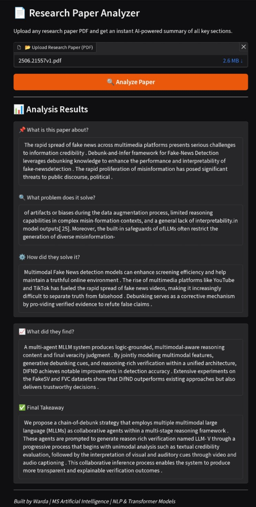

# 📄 Research Paper Analyzer

An AI-powered system that automatically extracts 
and analyzes key information from any research 
paper PDF using transformer-based NLP models.

## 🔴 Live Demo
👉 [Click here to try it live]([https://1e4736adf86a18c157.gradio.live](https://huggingface.co/spaces/Wardaali/research-paper-analyzer))

## 📌 What it does
Upload any research paper PDF and instantly get:
- 📌 What is this paper about?
- 🔍 What problem does it solve?
- ⚙️ How did they solve it?
- 📊 What did they find?
- ✅ Final Takeaway

## 🛠️ Tools & Technologies
- Python
- Hugging Face Transformers
- DistilBART (transformer summarization model)
- PyPDF2 (PDF text extraction)
- Gradio (interactive interface)
- Google Colab

## ⚙️ System Architecture
PDF Upload → Text Extraction → Text Cleaning
→ Section Detection → Transformer Summarization
→ Structured Output

## 📂 Dataset
18 research papers collected from arXiv.org
covering NLP, Vision-Language Models, 
Multimodal AI, and Biomedical topics.

## 📊 Results
- Successfully processes ANY research paper PDF
- Detects 5 key sections automatically
- Generates human-readable AI summaries
- Tested on 18+ diverse research papers
- Works on unseen papers not in original dataset

## 🖼️ Screenshots

## 🚀 How to Run
1. Open notebook in Google Colab
2. Run all cells in order
3. Upload any research paper PDF
4. Click Analyze Paper button
5. Get instant AI analysis

## 🔮 Future Work
- Add citation extraction
- Support batch processing
- Add paper comparison feature
- Export summary as PDF report

## 👩‍💻 Built By
Warda Ali | MS Artificial Intelligence  
NLP & Transformer Models | Islamabad, Pakistan
